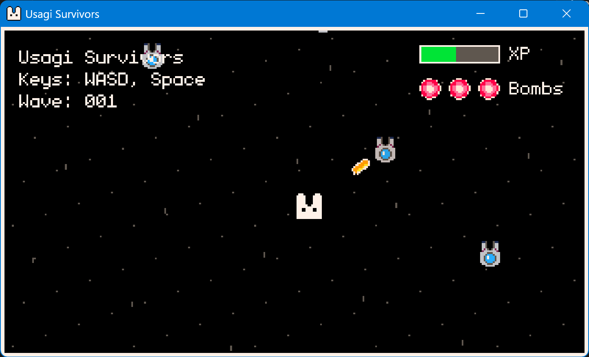
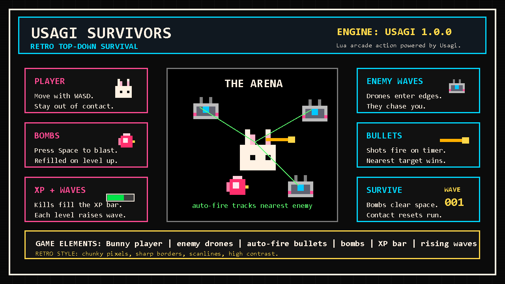

# Usagi Survivors
Usagi Survivors is a fast top-down "Vampire Survivors" clone game created with the [Usagi Engine](https://github.com/brettchalupa/usagi) for rapid 2D game dev.

Level up by defeating enemies to refill bombs, then time each blast to clear space and stay alive.

  
## Pics

### Screenshot

### Infographic

  
## Input

| Key | Behavior |
| --- | -------- |
| `Arrow Keys` | Move the player. |
| `Space` | Use one bomb if available (plays `explosion`); if none remain, plays `clear`. |
| `Esc` | Opens the pause menu (built-in to Usagi). |
| `Alt+Enter` | Toggle fullscreen (engine shortcut). |

  
## Stack

| Area | Choice |
| ---- | ------ |
| Language | [Lua 5.5](https://www.lua.org/manual/5.5/) |
| Engine | [Usagi 1.0.0](https://github.com/brettchalupa/usagi) |

  
# Credits

**Created By**

Samuel Asher Rivello. Over 25 years XP with game development (2025); over 10
years XP with Unity (2025).

**Contact**

| Channel | Link |
| ------- | ---- |
| Twitter | [@srivello](https://twitter.com/srivello) |
| Git | [Github.com/SamuelAsherRivello](https://github.com/SamuelAsherRivello) |
| Resume & Portfolio | [SamuelAsherRivello.com](https://www.SamuelAsherRivello.com) |
| LinkedIn | [Linkedin.com/in/SamuelAsherRivello](https://www.linkedin.com/in/SamuelAsherRivello) |
